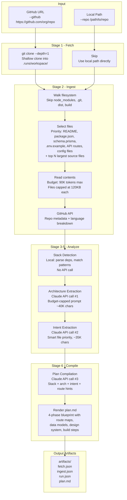

# Mimekit

MimeKit analyzes public GitHub repositories (or local repos) and generates an executable implementation blueprint -- a detailed plan that a coding agent (Claude Code, Codex, etc.) can follow to recreate the project from scratch.

It produces:

- Architecture model (components, edges, tech mapping)
- Detected stack fingerprint (frontend, backend, DB, auth, infra)
- Behavioral intent spec (purpose, features, flows, rules, contracts)
- Executable build prompt with route blueprints, data models, and design system
- Stack swap rewrites without full re-analysis

## How It Works



### Pipeline stages

| Stage | What it does | API calls |
|-------|-------------|-----------|
| **Fetch** | Shallow `git clone` of the target repo (GitHub only; skipped for local repos) | None (git) |
| **Ingest** | Walks the filesystem, selects important + sampled files, reads contents with token budgets | GitHub REST API (repo metadata + languages) |
| **Stack** | Pattern-matches `package.json`, file extensions, config files to detect frameworks | None (local) |
| **Architecture** | Sends repo summary + stack to Claude, returns typed component/edge model | Anthropic Messages API |
| **Intent** | Sends prioritized file subset + condensed architecture to Claude, returns behavioral spec | Anthropic Messages API |
| **Plan** | Sends stack + architecture + intent + route/design hints to Claude, returns structured plan | Anthropic Messages API |

Each Claude call has retry logic (3 attempts with 15s/30s backoff on rate limits), a 240-second timeout, and a deterministic fallback that runs if the API is unavailable.

## Stack

- Next.js App Router + TypeScript
- API routes (server-side pipeline)
- Zod schema validation
- Anthropic Claude API (Claude Sonnet 4.5)
- `simple-git` for repository cloning
- No database (in-memory run cache)

## Quick Start

### Web UI

```bash
cp .env.example .env
# Add your ANTHROPIC_API_KEY to .env
npm install
npm run dev
```

Open [http://localhost:3000](http://localhost:3000), paste a GitHub URL, and run.

### CLI Harness

The harness runs the full pipeline from the command line. It clones repos locally via git (or reads a local directory), which gives richer file access than the GitHub Content API.

```bash
# Analyze a GitHub repository
npm run harness -- --github https://github.com/org/repo --scan-mode deep

# Analyze a local repository
npm run harness -- --repo /path/to/local/repo --scan-mode deep

# Quick scan (fewer files sampled)
npm run harness -- --github https://github.com/org/repo --scan-mode quick

# Specify a branch or tag
npm run harness -- --github https://github.com/org/repo --ref main --scan-mode deep
```

**Options:**

| Flag | Description |
|------|-------------|
| `--github <url>` | GitHub repository URL to analyze |
| `--repo <path>` | Local repository path to analyze |
| `--ref <branch\|tag\|sha>` | Branch, tag, or commit to checkout (defaults to default branch) |
| `--scan-mode quick\|deep` | `quick` samples 10 source files, `deep` samples 30 |

**Output:**

```
.runs/run_<timestamp>_<id>/
  workspace/          # Cloned repo (GitHub) or symlinked (local)
  artifacts/
    fetch.json        # Git clone metadata (GitHub only)
    ingest.json       # Full repo snapshot with file contents
    run.json          # Complete analysis (snapshot + stack + architecture + intent + plan)
    plan.md           # Rendered executable blueprint
```

The `plan.md` is the primary artifact -- a self-contained markdown document you can feed directly to a coding agent.

### Web UI vs CLI

Both paths share the same analysis engine (`analysis.ts`, `claude.ts`, `prompt-compiler.ts`, `stack-detector.ts`). The difference is how the repo is fetched:

| | Web UI | CLI Harness |
|---|---|---|
| Entry point | `POST /api/analyze` | `npm run harness` |
| Repo access | git clone (if git available) or GitHub Content API fallback | git clone (GitHub) or direct filesystem (local) |
| Local repos | Not supported | `--repo /path/to/repo` |
| Artifacts | In-memory run cache | Written to `.runs/` directory |
| Auth | GitHub OAuth session | None needed |

## Environment

Copy `.env.example` to `.env` and configure:

| Variable | Required | Description |
|----------|----------|-------------|
| `ANTHROPIC_API_KEY` | For LLM analysis | Claude API key. Without it, deterministic fallbacks run instead. |
| `GITHUB_TOKEN` | Optional | Improves GitHub API rate limits for repo metadata |
| `GITHUB_ID` | For web UI auth | GitHub OAuth App client ID |
| `GITHUB_SECRET` | For web UI auth | GitHub OAuth App client secret |
| `NEXTAUTH_SECRET` | For web UI auth | Random secret for session encryption |
| `NEXTAUTH_URL` | For web UI auth | `http://localhost:3000` in local dev |

The CLI harness loads `.env` automatically. The web UI (Next.js) loads `.env.local` as usual.

### Tuning limits

These can be set in `.env` to adjust ingestion behavior:

| Variable | Default | Description |
|----------|---------|-------------|
| `MAX_REPO_KB` | 50000 | Max repo size to process (KB) |
| `MAX_FILE_BYTES` | 120000 | Max individual file size to read |
| `MAX_SNAPSHOT_TOKENS` | 90000 | Total token budget for ingested file contents |
| `ANTHROPIC_MODEL` | `claude-sonnet-4-5-20250929` | Claude model to use |
| `HARNESS_CLONE_DEPTH` | 1 | Git clone depth |
| `HARNESS_MAX_FILE_SIZE` | 120000 | Max file size for harness ingest |

## GitHub OAuth Setup

1. Create a GitHub OAuth App at https://github.com/settings/developers
2. Set callback URL to `http://localhost:3000/api/auth/callback/github`
3. Put client id/secret in `.env` as `GITHUB_ID` and `GITHUB_SECRET`
4. Generate a random value for `NEXTAUTH_SECRET`
5. Restart dev server and click **Sign In with GitHub** on the intake page

## Testing

```bash
npm test            # Run all tests
npm run test:watch  # Watch mode
npm run typecheck   # TypeScript check
```

## Prompts

This section documents the prompt templates used by the analysis pipeline.

Source files:

- `lib/services/claude.ts` -- shared Claude caller with retry, timeout, schema validation
- `lib/services/analysis.ts` -- architecture, intent, and stack-swap prompts
- `lib/services/prompt-compiler.ts` -- plan compilation prompt and markdown renderer

### Shared Claude System Prompt

All Claude JSON calls use this system instruction:

```text
You are a strict JSON API. Return only valid JSON. Do not include markdown fences, comments, or prose.
```

### Architecture Extraction

Defined in `extractArchitecture()` (`lib/services/analysis.ts`):

```text
Return valid JSON only.

Task: extract architecture model for this repository summary.

Output schema:
<ARCHITECTURE_MODEL_SCHEMA_JSON>

Rules:
- components[] must include id, name, role, tech[], inputs[], outputs[]
- edges[] must use type in {request,data,event}
- no prose outside JSON

Repository summary:
<REPO_SNAPSHOT_SUMMARY (budget-capped ~40K chars)>

Detected stack:
<STACK_JSON>
```

### Intent Extraction

Defined in `extractIntent()` (`lib/services/analysis.ts`). Uses a **smart file selection** strategy that prioritizes high-signal files (README, database schemas, API routes, config) and embeds a condensed architecture summary:

```text
Return valid JSON only.

Task: extract behavioral intent spec for the TARGET REPOSITORY described below.
The system_purpose should describe what THIS application does (not the analysis tool).
The core_features should list the actual features of THIS application.

Output schema:
<INTENT_SPEC_SCHEMA_JSON>

Rules:
- use concise, concrete statements about the TARGET repository
- system_purpose: strip HTML tags, describe the app in plain text
- core_features: list actual features visible in the source code and README
- user_flows: derive from routes and UI components
- business_rules: derive from auth, validation, and config patterns
- include assumptions and unknowns
- no prose outside JSON

Repository and architecture summary:
<SMART_REPO_SUMMARY (prioritized files, condensed arch, ~35K chars)>
```

### Stack Swap Intent Rewrite

Defined in `rewriteIntentForStackSwap()` (`lib/services/analysis.ts`):

```text
Return valid JSON only.

Task: rewrite intent spec after tech stack swap.
Rewrite only impacted modules/interfaces/behavior.

Output schema:
<INTENT_SPEC_SCHEMA_JSON>

Swap descriptor:
<SWAP_DESCRIPTOR_JSON>

Architecture model:
<ARCHITECTURE_MODEL_JSON>

Existing intent:
<PREVIOUS_INTENT_JSON>

Repository summary:
<REPO_SNAPSHOT_SUMMARY>
```

### Plan Compilation

Defined in `compileExecutablePlan()` (`lib/services/prompt-compiler.ts`):

```text
Return valid JSON only.

Task: compile an executable build plan prompt for a coding agent.

Output schema:
<STRUCTURED_PLAN_SCHEMA_JSON>

Rules:
- keep build steps concrete, ordered, and directly executable
- include route-level plan with page layout descriptions for each user-facing route
- preserve source layout paradigms (floating menus, sticky bars, command overlays)
- describe functionality logic and rule enforcement, not just feature names
- if DB signals exist, include concrete schema/index/migration guidance
- include design system with explicit color tokens, radius scale, motion, and distinctive traits
- include concrete UI token guidance with hex colors and component styling behavior
- keep string values concise; total JSON output MUST be under 9000 tokens
- derive from architecture + intent + inferred route/design hints
- avoid placeholders like 'as needed'

Artifacts:
<PLAN_ARTIFACTS_JSON>
```

### Runtime Behavior

- Each prompt response is validated against a Zod schema
- If `ANTHROPIC_API_KEY` is missing, deterministic fallback generators produce a baseline plan
- Claude JSON parsing includes schema drift normalization (for common fields like `type`, `from`, `to`)
- Failed Claude calls retry 3 times with 15s/30s exponential backoff on rate limits and server errors
- A 240-second fetch timeout prevents silent connection drops
- Output truncation (`stop_reason: max_tokens`) is detected and logged
- All Claude calls log stage label, attempt number, prompt size, and error details
